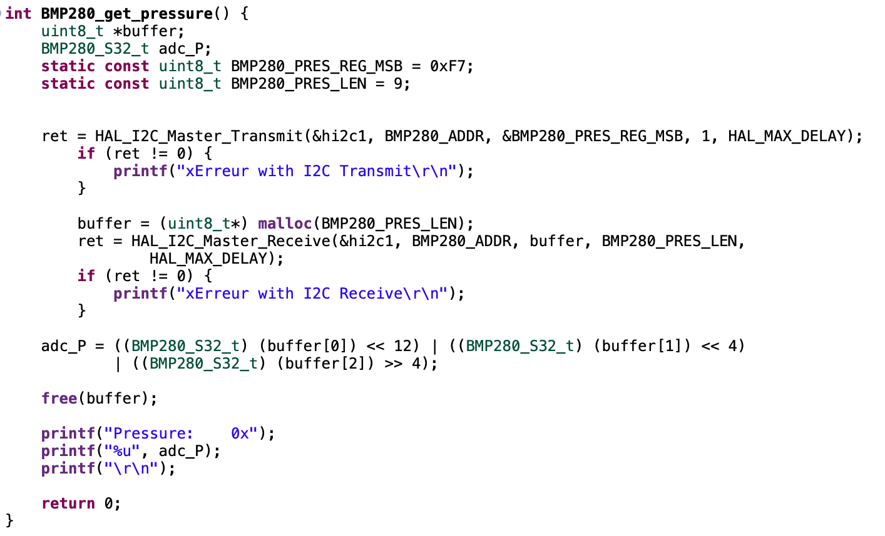

## Sommaire

- [Présentation](#présentation)
- [TP1 - Bus I2C](#tp1--bus-i2c)
  - [Capteur BMP280](#capteur-bmp280)
  - [Setup du STM32](#setup-du-stm32)
  - [Communication I²C](#communication-ic)
  - [Communication avec le BMP280](#communication-avec-le-bmp280)
  - [ADXL345 et MPU9250](#adxl345-et-mpu9250)
- [TP2 - Interfaçage STM32 - Raspberry x & TP3 - Interface REST](#tp2---interfaçage-stm32---raspberry-x--tp3---interface-rest)
  - [Flash de la SD](#flash-de-la-sd)
  - [Accès à la Raspberry Pi](#accès-à-la-raspberry-pi)
  - [Utiliser python sur Rasberry Pi](#utiliser-python-sur-rasberry-pi)
  - [Communiquer par UART avec la Raspberry](#communiquer-par-uart-avec-la-raspberry)
  - [BACK-END Raspberry Pi](#back-end-raspberry-pi)
  - [Astuces](#astuces)
  - [Server REST - FastAPI](#server-rest---fastapi)
- [TP4 - Bus CAN](#tp4---bus-can)
- [TP5 - Intégration](#tp5---intégration)

# TP Bus et Réseaux

Bienvenue sur le ReadMe de  Marie Caronello et Romain Pace, élèves en spécialité ESE à l'ENSEA. Ce document présente en détail les étapes de notre TP, avec pour objectif d'approfondir notre compréhension des bus et des réseaux.

## Présentation

L’objectif de ce TP est de collecter les données du capteur BMP280 via le microcontrôleur STM32, puis de gérer ces données à l’aide d’une interface API. La figure ci-dessous présente l’architecture générale du système :

<p align="center">
  
</p>

## TP1 - Bus I2C

La première étape est de mettre en place la communication entre le microcontrôleur et les capteurs température, pression (BMP280) via  le bus I²C. Le capteur BMP280 comporte deux composants en I2C, ils vont donc partager le même bus et le STM32 va jouer le rôle de Master.


### Capteur BMP280

Avant de configurer le capteur BMP280 nous allons identifier certains éléments.

- Adresses I2C possibles pour le composant : Les adresses I2C du capteur BMP280 sont définies par les 6 premiers bits fixes : 111011x. Le dernier bit dépend de la connexion du pin SDO :
  - Si SDO est connecté à GND, l'adresse sera 1110110 (0x76).
  - Si SDO est connecté à VDDIO, l'adresse sera 1110111 (0x77).
<p align="center">
  
</p>  

- Le registre et la valeur permettant d'identifier ce composant : Le registre utilisé pour identifier le capteur BMP280 est le registre 0xD0, et la valeur associée est 0x58. Cette valeur confirme qu'il s'agit bien du capteur BMP280, comme spécifié en page 26 du datasheet.
<p align="center">
  
</p>

- Le registre et la valeur permettant de placer le composant en mode normal : Le registre de contrôle est 0xF4.La valeur à mettre dépend du mode que l'on souhaite activer. Pour placer le capteur en mode normal les derniers bits sont 11. Par exemple si on prend le cas d'un oversampling égal à 1 pour la température et la pression alors la valeur à configurer est 001 001 11 ce qui donne la valeur hexadécimale 0x27.
<p align="center">
  
</p>
<p align="center">
  
</p>

- Les registres contenant l'étalonnage du composant : Les registres contenant les données d'étalonnage sont situés entre les adresses 0x88 et 0xA1.
<p align="center">
  
</p>

- Les registres contenant la température (ainsi que le format) : Les registres utilisés pour lire la température sont 0xFA, 0xFB, et 0xFC.
<p align="center">
  
</p>

- Les registres contenant la pression (ainsi que le format): Les registres utilisés pour lire la pression sont 0xF7, 0xF8, et 0xF9.
<p align="center">
  
</p>

  - Les fonctions permettant le calcul de la température et de la pression compensées en format entier 32 bits : Ces fonctions sont à la page 45 et 46 de la datasheet et donnent :
  - La fonction de calcul pour la pression est : double bmp280_compensate_P_double(BMP280_S32_t adc_P)
  - La fonction de calcul pour la température est : double bmp280_compensate_T_double(BMP280_S32_t adc_T) 

Ce TP a permis de comprendre les principaux registres et leurs rôles dans la configuration et la lecture des données du capteur BMP280 via le bus I²C. 

### Setup du STM32

Dans cette partie, nous avons determiné les broches pour configurer le Bus CAN, l'USART2, l'USART3 et la communication I2C.

- Pour la connexion à l'aide du bus CAN entre le moteur et la STM32 : Rx -> PB8; Tx -> PB9
- Pour la connexion USART2 entre le port USB et la STM32 : Rx ->PA3 ; Tx -> PA2
- Pour la connexion USART1 entre la Raspberry Pi et la STM32 : Rx -> PA9 ; Tx -> PA10
- Pour la conneion I2C entre le capteur BMP280 et la STM32 : SDA -> PB7 ; SCL -> PB6

On commence par s'intéresser dans un premier temps à la redirection du printf. Pour cela dans le fichier stm32f4xx_hal_msp.c, on ajoute du code permettant de gérer le printf, à l’aide de putchar. Lors du test, il ne faut pas oublier le \r\n pour que le message s’affiche directement.
<p align="center">
  
</p>

### Communication I²C

#### Communication avec le BMP280

On utilise les fonctions Transmit et Receive de la bibliothèque HAL pour établir la communication I²C. 

- HAL_StatusTypeDef HAL_I2C_Master_Transmit(I2C_HandleTypeDef *hi2c, uint16_t DevAddress, uint8_t *pData, uint16_t Size, uint32_t Timeout)
- HAL_StatusTypeDef HAL_I2C_Master_Receive(I2C_HandleTypeDef *hi2c, uint16_t DevAddress, uint8_t *pData, uint16_t Size, uint32_t Timeout)

Où on a :

- I2C_HandleTypeDef hi2c: structure stockant les informations du contrôleur I²C
- uint16_t DevAddress: adresse I³C du périphérique Slave avec lequel on souhaite interagir.
- uint8_t *pData: buffer de données
- uint16_t Size: taille du buffer de données
- uint32_t Timeout: peut prendre la valeur HAL_MAX_DELAY

Cependant, il est important de noter que ces fonctions exigent une adresse de 8 bits, tandis que l'adresse I²C est, elle, codée sur 7 bits. Par conséquent, il est nécessaire de décaler l'adresse I²C d'un bit vers la gauche avant de l'utiliser avec les fonctions HAL.

##### Identification du BMP280
Dans un premier temps, il faut identifier notre capteur pour cela nous devons lire la valeur du registre ID (0xD0). On doit donc envoyer l'adresse du registre ID, 0xD0, et recevoir 1 octet correspondant au contenu du registre, 0x58, on fait cela avec les fonctions HAL_StatusTypeDef HAL_I2C_Master_Receive et HAL_StatusTypeDef HAL_I2C_Master_Transmit. On va construire une fonction qui va renvoyer la valeur du registre 0xD0.

<p align="center">
  
</p>

Après éxécution de ce code nous obtenons 88 soit en hexadécimal 0x58, c'est ce qu on souhaitait obtenir.

##### Configuration du BMP280

On va donc à présent configurer le BMP280 en mode normal avec une Pressure oversampling = x16 et une Temperature oversampling = x2. On va utiliser la documentation et découvrir que le regitsre de contrôle 0xF4 vu précédemment permet de configurer tous ces éléments. En effet :

- Pressure oversampling : x16 -> 101
- Temperature oversampling : x2 -> 010
- mode normal : 11

Nous avons donc écrit la valeur 0b01010111 qui vaut 0x57 en hexadécimal dans le registre 0xF4.

<p align="center">
  
</p>

##### Récupération de l'étalonnage, de la température et de la pression

Maintenant on veut récupérer les valeurs de la température et de la pression et envoyez sur le port série le valeurs 32 bit non compensées de la pression de la température. Pour cela il faut envoyer l'adresse du registre et ensuite on reçoit l'étalonnage dans un tableau adapté. L'adresse du registre est donnée par la documentation :

<p align="center">
  
</p>

Le registre d'étalonnage est ici notre point d'intérêt, et son adresse correspond à celle du premier élément du tableau, soit 0x88. Nous devons donc transmettre cette adresse, puis recevoir les données d'étalonnage dans un tableau de 26 éléments. Ensuite, nous avons organisé les données d'étalonnage dans le format approprié pour effectuer le calcul de compensation.

<p align="center">
  
</p>

On va donc à l'aide des indications d'étalonnage creer deux focntion get_pressure et get_temperature qui vont permettre de réccupérer la température grâce aux différents registres. 
<p align="center">
  
</p>

##### Calcul des températures et des pression compensées

Pour cette dernière partie , une fois qu on a récupéré la température et la pression nous devons la compenser pour pouvoir l'intérpréter correctement et pour que ces valeurs soient au bon format. Pour cela nous avons juste a copier les codes présents dans la documentation page 45 et 46 :
<p align="center">
  
</p>

### ADXL345 et MPU9250

Après avoir configurer les capteurs sur le BMP280, on veut configurer l'ADXL345 et le MPU9250 sur le même principe.

#### ADXL345

Tout d'abord interessons nous à l'ADXL345, nous allons créer deux fonctions : ADXL345_check() et ADXL345_init(), de la même manière que pour le BMP280. On ajoute aussi une fonction pour lire les données (x, y, z) : ADXL345_read_axes(int16_t* x, int16_t* y, int16_t* z).

<p align="center">
  
</p>

#### MPU9250

De la même manière pour le MPU9250 on initialise deux fonctions MPU9250_init() et MPU9250_check() pour initialiser le capteur et le configurer. Puis comme le MPU9250 permet d'obtenir des informations avec un accéléromètre, un gyroscope et un magnétomètre on va établir 3 fonctions pour lire ces différentes données : MPU9250_read_accel(SensorData *accel) MPU9250_read_gyro(SensorData *gyro) MPU9250_read_mag(SensorData *mag). Enfin on va créer une fonction global qui permettra l'envoie de ces données MPU9250_send_data(MPU9250_Data *data). On établit alors une strucutre pour stocker les données en fonction de leur catégorie du capteur SensorData et une strusture pour garder l'ensemble des données MPU9250_Data.

<p align="center">
  
</p>

## TP2 - Interfaçage STM32 - Raspberry x & TP3 - Interface REST
### Flash de la SD

En utilisant [Rasberry Pi Imager](https://www.raspberrypi.com/software/), on flash la SD avec l'OS: 
````Raspberry pi OS(other) -> Raspberry pi os lite(32-bit)````

Afin que la carte se connecte à un réseau on renseigne soit :
- sur l'interface le ssid et le mdp de la wifi  
- sur le fichier ````wpa_supplicant.conf```` le code suivant (si il n'existe pas créez le):
````r
ctrl_interface=DIR=/var/run/wpa_supplicant GROUP=netdev
update_config=1
country=FR

network={
 	ssid="Bbox-BE3D805C"
 	psk="idontlovelinux"
   	id_str="HOME"
	priority=1
}

network={
 	ssid="D060-2GHz"
 	psk="ilovelinux"
   	id_str="SCHOOL"
	priority=2
}
````

Ensuite en passant par le finder ou le terminal ajouter un fichier ssh (vide) dans le boot. Puis modifier les fichiers cmdline.txt et config.txt
````
touch ssh
open cmdline.txt
open config.txt
````
Dans le ````cmdline.txt````on enlève ````console=serial0,115200````
Dans le ````config.txt````on ajoute ````enable_uart=1   dtoverlay=disable-bt````

La carte SD est prête à être connecter pour que la Rasberry Pi se connecte au réseau et reçoive une connexion ssh.

### Accès à la Raspberry Pi

Après avoir alimenté la raspberry pi.
On souhaite ensuite se connecter en ssh depuis l’ordinateur. Il faut se connecter au même reseau que le ssid renseigné dans la Raspberry.
On utilise nmap pour repérer l'adresse IP que le routuer a attribué à la  Raspberry Pi. [Nmap Documentation](https://nmap.org/man/fr/man-briefoptions.html) 

````ruby
nmap 192.168.88.0/24 -sn            #En général ip.du.routeur/24
````
> [!TIP]
> Pour scanner rapidement le reseau il faut être en utilisateur root pour faire cette operation 
>```ruby 
> sudo -i
>```

Dans un environnement où plusieurs raspberry pi sont connectés au même réseau que le notre. Il faut tester un par un les adresses IP jusqu'a trouver la bonne 
````ruby 
ssh adresse.ip
ssh user@adresse.ip                 #Si vous souhaitez vous connectez sur un user, créer au préalable
````

### Utiliser python sur Rasberry Pi
Dans notre cas d'apllication nous allons devoir utilsier python et certain packages.
Pour faire cela, on doit obligatoirement créer un environnement python, autrement il est impossible d'installer des packages python.
````ruby
python -m venv defaut               #Création de l'environnement "defaut"
source defaut/bin/activate          # Activation de l'environnement
pip install requirement.txt      #Installation des requirement sur l'environnement "defaut"
````
Un fois que l'environnement est créer et activer alors il nous tout a fait possible d'installer les packages. Prenez garde a bien activer votre envrionnement a chaque redémarrage de la rasbery pi
### Communiquer par UART avec la Raspberry
Pour communiquer avec la rasberry pi on peut utiliser minicom
````ruby 
sudo apt install minicom
minicom -D /dev/ttyAMA0
````
ou screen une fonction native sous Linux
```` ruby
sudo apt install screen
screen /dev/ttyAMA0 115200 
````
> [!CAUTION]
> En utilisant cette methode veillez à bien fermer le screen en fin d'utilisation. 

### BACK-END Raspberry Pi 

Après avoir coder le back-end du raspberry, ce qu'il faut comprendre c'est que l'interface via le web ne permet d'aucune sorte de créer des requêtes.

Pour faire cela on va devoir utiliser la fonction CURL du terminal en choissiant la méthode l'adresse ip et les arguments ````suivant -d````
````ruby
curl -X POST http://192.168.88.234:5000/api/welcome/ -d "welcome" 
````
Cette commande post sur l’adresse /api/welcome/ l’argument welcome. Ensuite pour recupérer les données coté raspberry on doit utilisé ````request.get()````

### Astuces
Pour éviter de coder sur le nano du Rasberry pi, qui est ni ergonomique, ni facile d'utilisation. On peut choisir de coder sur son laptop avec VSCode par exemple puis de upload les fichiers sur la raspberry [SCP documentation](https://raspberry-pi.fr/transferer-fichiers-raspberry-ssh/).

Pour transférer un fichier ou un dossier:
```` ruby
#Permet de transférer un fichier depuis le laptop vers le Raspberry 
    scp mainSurPC.py 192.168.88.234:/home/romingo/server/mainSurRasb.py 
#Permet de transférer un dossier depuis le laptop vers le Raspberry
    scp -r ~/serverSurPC 192.168.88.234:/home/romingo/serverSurRasp
```` 

### Server REST - FastAPI

Pour utiliser fastapi, l faut installer sur l'environnement "defaut" ````fastapi[standard]````. On conseille de stocker cela sur le requirements.txt.

Pour lire correctement le code d'une page fastAPI, il faut repérer le décorateur au dessus de chaque fonction. Celui definit quand est ce que la fonction va être executé, pour un POST, un GET ou autre.

Ensuite l'argument de la fonction est fourni par fastAPI à la fonction. Ci dessus on demande la requete reçu lors d'une requête GET sur la page ````.../pres````, celle ci contient plusieurs attributs intéressants que nous renverrons en sortie de la fonction. 

````python
@app.GET('/pres')
def return_all_previous_presure(request: Request):
  	return {"pressure": pres,"method": request.method}
  
````

Afin de gérer les erreurs 404 on utilisera les ````HTTPException````et le ````@app.exception_handler(HTTPException)````. On décide ici de rediriger l'utilisateur sur une page html customisé.

````python
@app.exception_handler(HTTPException)
def custom_404_handler(request:  Request, exc:  HTTPException): 
    if exc.status_code == 404: 
        return templates.TemplateResponse("page_not_found.html", {"request":  request}, status_code=404)
    else: 
        return JSONResponse({"detail":  exc.detail}, status_code=exc.status_code)

````

On choisit également de traiter toute les pages non attribuées que l'utilisateur pourrait essayer d'accéder.
````python 
@app.get("/{full_path: path}")
async def catch_all_url(request:  Request, full_path:  str): 
    raise HTTPException(status_code=404, detail=f"Page '{full_path}' non trouvée")
````

Afin d'apercevoir le résultat de cette intégration: cf [TP5 - Integration](#tp5---intégration) 
## TP4 - Bus CAN

L'objectif ici est de mettre en place un périphérique sur un bus CAN entre le moteur et la carte STM32L476. On devra donc ici réussir à piloter un module moteur pas-à-pas alimenté en 12V via le bus CAN, en réglant la vitesse de communication à 500 kbit/s, en prenant en compte des spécificités techniques liées au ratio de timing CAN.

On definit donc le CAN tel que Rx -> PB8 et Tx -> PB9. Deplus on veut que la vitesse du CAN soit de 500kbit/s ainsi on doit mettre le prescaler à 6, le Time Quanta in bit Segment 1 à 12 et le Time Quanta in bit Segment 2 à 2. 

Deplus pour perfectionner la configuration on s'intéresse à l'angle tel que donné dans la documentation, on choisit de se mettre en mode manuel. 

<p align="center">
  
</p>

Premièrement on souhaite faire bouger le moteur de 90 degrès dans un sens puis dans l'autre sens pour cela on va créer une fonction permettant de faire bouger le moteur en fonction de l'angle et du sens. Pour cela on va utiliser le pheader qui va permettre de caractériser les informations, dans un premier temps on a choisit de mettre le moteur en mode normal donc StdId = 0x61, enfin on va transmettre les informations sous une liste de 2 éléments donc DLC = 0x02.

<p align="center">
  
</p>

Ensuite on veut faire en sorte que le mouvement du moteur soit proportionnel à la valeur du capteur. Pour cela on va retenir la température au lancement du code puis on va faire bouger le moteur en fonction de la variation de température, le coefficient utilisé pour modéliser cette variation de température est 2. Si la variation est supérieur à 180 degrés alors le moteur tourne dans le sens horaire, à l'inverse si la variation est inférieur à 180 degrés alors le moteur tourne dans le sens imaginaire. 

<p align="center">
  
</p>


## TP5 - Intégration 

Interface homme-machine se fait au travers du fastapi qui permet d'envoyer des requete au server python directement depuis la page http://.../docs 

<p align="center">
  
</p>


Apres avoir envoyé une requête GET_T, on reçoit la température provenant de la stm32

<p align="center">
  
</p>


[ ]